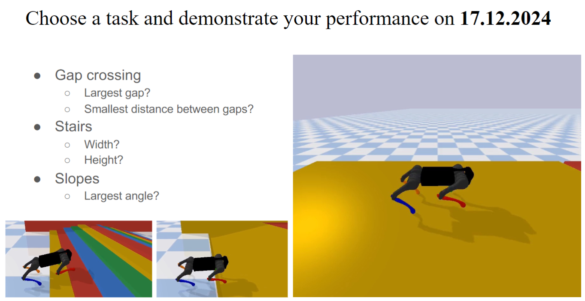

# 中文说明文件


## 1.环境配置
- 1.1 添加虚拟环境 + 激活虚拟环境
    ```  
    virtualenv micro-507 --python=python3
    cd micro-507
    source Scripts/activate
    cd ..
    ```
- 1.2 安装依赖
    ```
    pip install -r requirements.txt
    ```
- 1.3 可以使用如下命令退出虚拟环境   
  ```
  deactivate
  ```

- 1.0 使用 conda 创建虚拟环境
    ```
    conda create -n micro-507 python=3.8
    source /c/Users/MATH-286-Dell/miniconda3/etc/profile.d/conda.sh
    conda activate micro-507
    pip install -r requirements.txt
    ```


## 2.文件说明
- **涉及知识点**
  - CPG 中央模式发生器
  - Deep RL 深度强化学习
- `quadruped_gym_env.py`
  - 定义强化学习环境


## 3.任务说明
- **run_cpg.py & hopf_network.py**
  - 完成`hopf_network.py` 文件中的步态生成器
  - 完成 `run_cpg.py` 的 joint space + cartesian space 的 PD 控制器
  - 运行 `run_cpg.py` 文件，查看效果
- **run_sb3.py & load_sb3.py**
  - 完成 `quadruped_gym_env.py`
    - 可以直接运行 `quadruped_gym_env.py` 查看效果
  - 使用 `run_sb3.py` 训练模型，默认训练 100万步，可以接着上次继续训练
  - 使用 `load_sb3.py` 查看训练结果


## 4.测试日志
- **2024.11.25 周一**
  - 发现 CPG-RL 训练出来的观测器维度有问题
  - ```env = VecNormalize.load(stats_path, env)``` 报错
- **2024.11.26 周二**
  - 发现是因为 `quadruped_gym_env.py` 中的 `linalg.inv` 导致模拟非常慢
- **2024.11.27 周三**
  - Colab 训练 390K 步，无 noise 训练效果不错
  - 观测到 Episode Length 似乎被规定为 1000 步，需要找到在哪里设置的
- **2024.11.29 周五**
  - 112924102748_cpg_SAC_FWD_RANDOM_460k_continued 行走极其稳定


## 5.待定任务
- [ ] Flagrun 目标点
- [ ] Robust 抗干扰
- [ ] Stairs 上楼梯
- [ ] 对比 PPO 与 SAC 算法区别

## 6.报告内容
- CPG
- CPG-RL
  - Focus on one of the task: `gaps`, `stairs`, `slopes`
  
  
